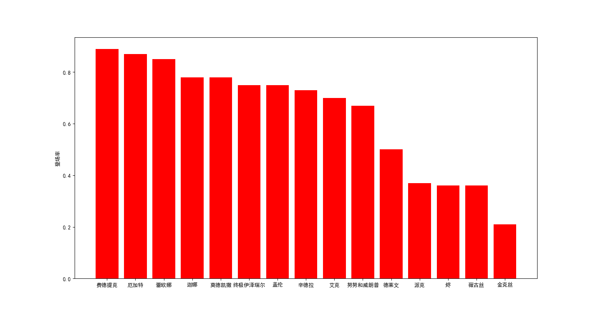
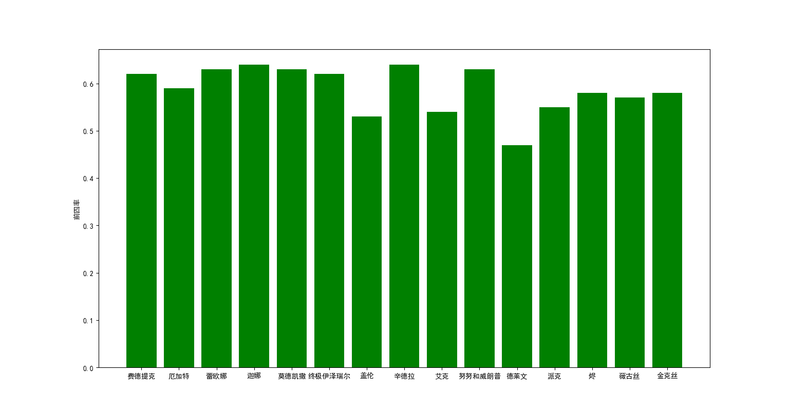
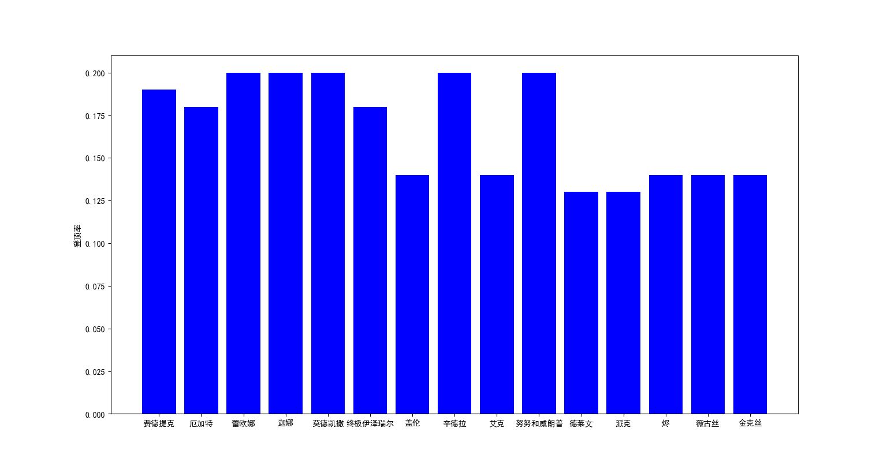
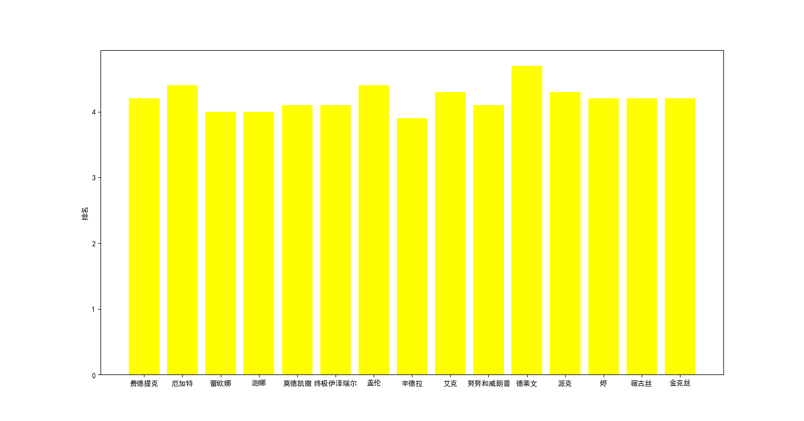
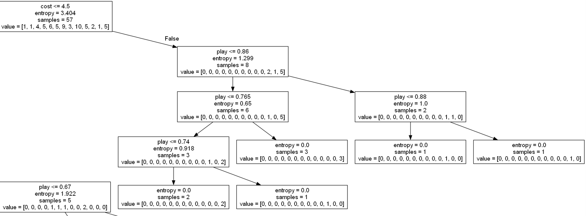
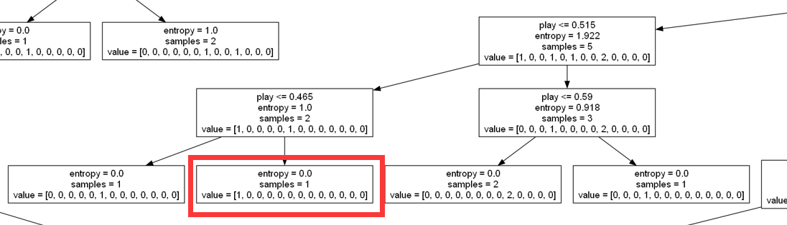
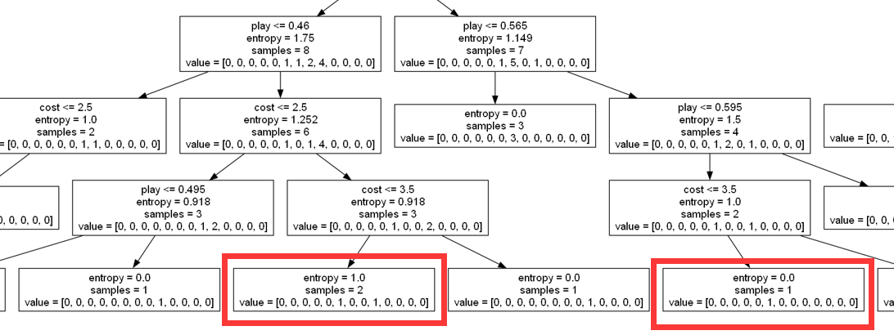

# 数据分析

我们通过官方网站获取了当前版本(s8.5)的57位英雄和116个装备的基本数据，并通过python进行了一些数据分析，以下是我们的一些数据挖掘过程和成果——

## 数据图表展示
通过[matplotlib]库，我们将数据绘制成图表，由此可以观察数据的总体情况。

以下是通过部分英雄数据制成的关于图表(按照英雄登场率降序排列)——

图1.1 登场率

图1.2 前四率

图1.3 登顶率

图1.4 排名

## 决策树展示

决策树是一种基于树结构的有监督学习算法，用于解决分类和回归问题。它将数据集分成多个小的子集，每个子集对应着决策树上的一个节点，其中每个节点又被进一步的分为更小的子集，直到达到终止条件（如节点数量、深度等）。在分类问题中，决策树会根据每个特征的重要性选择最佳的特征来进行划分，直到将数据集划分为只包含单一类别或满足终止条件为止；在回归问题中，决策树会根据每个特征的重要性选择最佳的特征来进行划分，直到将数据集划分为只包含单一数值或满足终止条件为止。

我们通过决策树分析了英雄的费用和使用率对登顶率的影响，以下是我们根据输出的决策树进行分析得到的结论——

注：因为得到的决策树图片较大，网站无法完整显示，这里根据结论显示决策树的部分信息。

### 结论1
五费用英雄中(cost=5)，使用率最高的英雄的登顶率并不是最高。

图2.1 结论1

### 结论2
胜率最低的英雄，使用率不是最低，反而有近50%的使用率。经询问后得知——此英雄是某个打法的核心组成，所以很多玩家会选择他。

图2.2 结论2

### 结论3
三费用英雄(cost=3)胜率普遍较低。

图2.3 结论3

[matplotlib]: https://matplotlib.org/