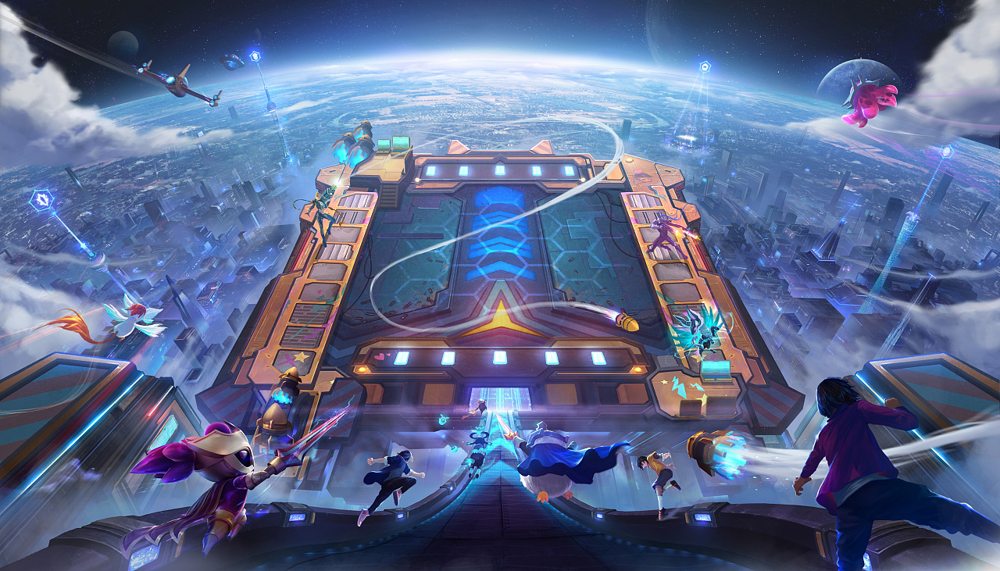

# 云顶之弈Wiki

## 注意
该网站记录了 s8.5 的英雄、装备、羁绊等数据，不具有时效性！！

## 背景设定
云顶之巅，聚梦之所。云顶之弈是英雄联盟中的游戏模式，玩家将和其他七位对手来到同一个战场，为至高无上的荣耀进行一次自由大混战。构筑并强化玩家的终极团队，然后见证战争在眼前拉开帷幕吧。

云顶之弈是一个全新游戏模式，玩家将和其他7名敌人（或朋友）进行一场各自为战的博弈对抗。招兵买马，融合英雄，提升战力，排兵布阵，成为最终立于战场上的赢家。

### 友情链接

mkdocs入门视频:[BV1FB4y1n7Gf]

如有改进建议，请联系邮箱 [dusforest@163.com]或[GitHub主页]

[dusforest@163.com]: ./
[GitHub主页]: https://github.com/Dusforest
[BV1FB4y1n7Gf]: https://www.bilibili.com/video/BV1FB4y1n7Gf/?spm_id_from=333.337.search-card.all.click

