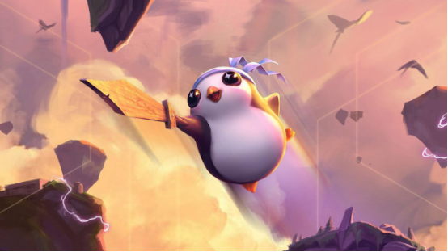
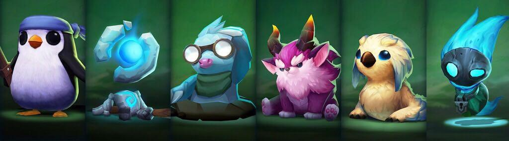

# 小小英雄
小小英雄作为玩家在云顶之弈中的化身，同时还能在极地大乱斗中为玩家加油。小小英雄是玩家和其他玩家互动的核心。小小英雄可以在共同选人阶段抢走亚索，险胜之后对着敌人来个超人舞步，还会在惜败时叹气。
小小英雄各自拥有独特的嘲讽，舞步和性格。

每个种类的小小英雄都有6种不同形态，其中1种传说，2种史诗和3种稀有，每种形态均有3个不同星级。获得传说形态的掉率5%，获得史诗形态掉率20%，稀有形态掉率75%。每款稀有小小英雄蛋开启54次后即可获得所有3个品种小小英雄的所有形态。

在游戏商城或掌盟商城购买稀有小小英雄蛋后，即可在战利品系统孵化、升级自己的小小英雄。

